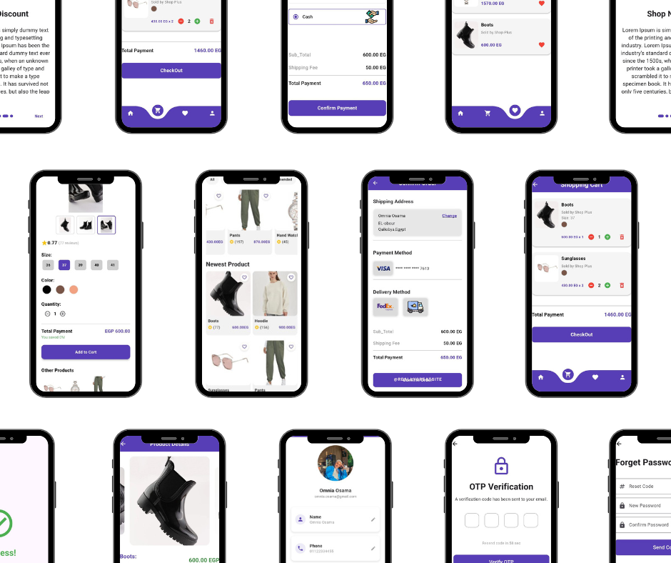

# shope_pluse

A modern and responsive E-Commerce mobile app built with Flutter, offering a smooth and user-friendly shopping experience.
Browse products, view detailed descriptions, add to cart, manage favorites, and complete secure payments — all in one place.

## Getting Started

This project is a starting point for a Flutter application.

A few resources to get you started if this is your first Flutter project:

- [Lab: Write your first Flutter app](https://docs.flutter.dev/get-started/codelab)
- [Cookbook: Useful Flutter samples](https://docs.flutter.dev/cookbook)

For help getting started with Flutter development, view the
[online documentation](https://docs.flutter.dev/), which offers tutorials,
samples, guidance on mobile development, and a full API reference.
## SHOP +

=======

